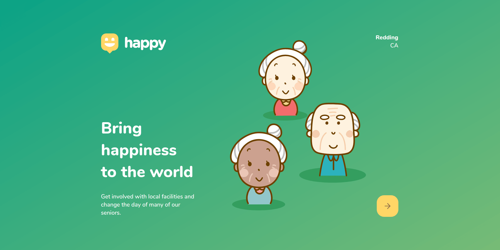
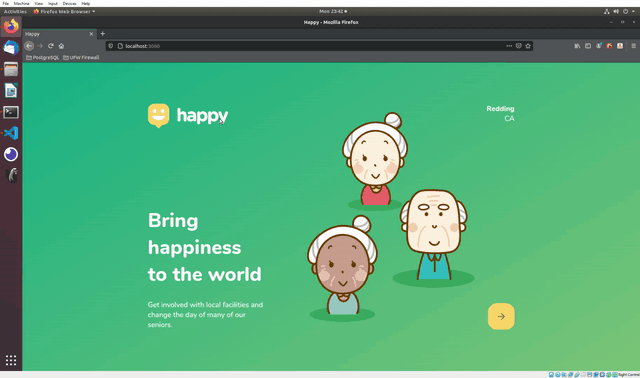
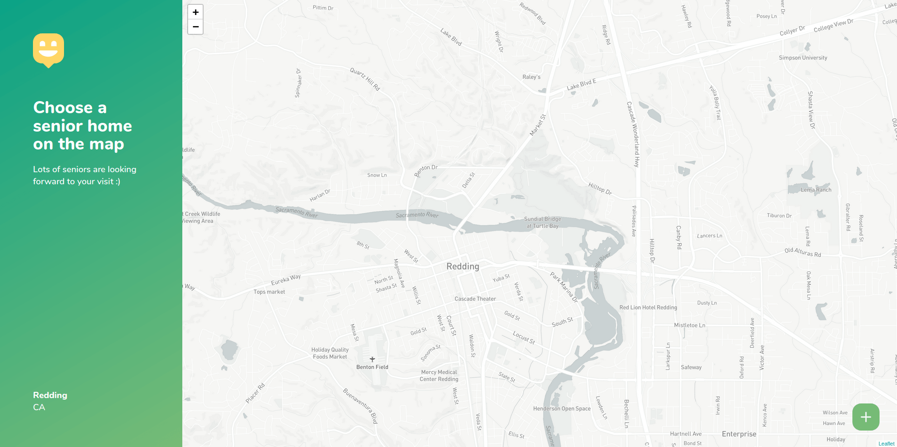

<p align="center">
  <a href="https://github.com/wilsonfsouza/happy-frontend-web/commits/main">
    
  </a>

   


  <a href="https://www.linkedin.com/in/wilsonfranca-dev-engineer/">
    
  </a>
</p>

<h1 align="center">
    
</h1>

<h4 align="center">
	Happy (In Progress)
</h4>

<p align="center">
 <a href="#-about-the-project">About</a> •
 <a href="#-funcionalidades">Functionalities</a> •
 <a href="#-layout">Layout</a> •
 <a href="#-how-to-run-the-project">How to run</a> •
 <a href="#-technologies">Technologies</a> •
 <a href="#-author">Author</a> •
 <a href="#user-content--license">License</a>
</p>


## 💻 About the project

Happy - is a platform to connect people who would like to visit, volunteer, or get involved with senior homes in Redding, CA. The app provides the information regarding visit hours, volunteer opportunities, and ways to help each local facility.

This project is a modification of the original project that is being developed in the third edition of the **NLW - Next Level Week** offered by [Rocketseat](https://nextlevelweek.com/inscricao/3).

The NLW 3 original proposal is an application in which orphanages can register their information, and people can schedule visits to play with the children.

---

## ⚙️ Functionalities

> In Process

---

## 🎨 Layout

<p align="center" style="display: flex; align-items: flex-start; justify-content: center;">
  
</p>

### Mobile

> In Process

### Web

<p align="center" style="display: flex; align-items: flex-start; justify-content: center;">
  

  
</p>

---

## 🚀 How to run the project

This project will be divided in three sections:
1. Backend (backend directory)
2. Frontend (frontend-web directory)
3. Mobile (frontend-mobile directory)

💡 Both Web and Mobile frontend apps need the RESTful API to execute.

### Requirements

Initial requirements:
[Git](https://git-scm.com), [Node.js](https://nodejs.org/en/), [Yarn](https://yarnpkg.com/), and a code editor of your choice.

#### Running the Backend (Server)

> In Process


#### Running the web application (Frontend)

```bash

# Clone this repository
$ git clone git@github.com:wilsonfsouza/happy-frontend-web.git

# Access the folder in your terminal/cmd
$ cd NLW3

# Change to the directory of your frontend-web
$ cd frontend-web

# Install dependencies
$ yarn install

# Start the app in development mode
$ yarn start

# The application will be open at port:3000 - acess http://localhost:3000

```

#### Running the mobile application (Frontend)

> In Process
---

## 🛠 Technologies

The following tools were used in this project:

#### **Website**  ([React](https://reactjs.org/)  +  [TypeScript](https://www.typescriptlang.org/))

-   **[React Router Dom](https://github.com/ReactTraining/react-router/tree/master/packages/react-router-dom)**
-   **[React Icons](https://react-icons.github.io/react-icons/)**
-   **[Leaflet](https://react-leaflet.js.org/en/)**
-   **[React Leaflet](https://react-leaflet.js.org/)**
-   **[Styled-components](https://styled-components.com/)**
-   **[Polished](https://polished.js.org/)**

> See the file  [package.json](https://github.com/wilsonfsouza/happy-frontend-web/blob/main/package.json)

#### [](https://github.com/wilsonfsouza/happy-frontend-web#server-nodejs--typescript)**Server**  ([NodeJS](https://nodejs.org/en/)  +  [TypeScript](https://www.typescriptlang.org/))

> In Process

#### [](https://github.com/wilsonfsouza/happy-frontend-web#mobile-react-native--typescript)**Mobile**  ([React Native](http://www.reactnative.com/)  +  [TypeScript](https://www.typescriptlang.org/))

> In Process

#### [](https://github.com/wilsonfsouza/happy-frontend-web#utilit%C3%A1rios)**Utilities**

-   Prototype:  **[Figma](https://www.figma.com/)**
-   Maps:  **[Leaflet](https://react-leaflet.js.org/en/)**
-   Editor:  **[Visual Studio Code](https://code.visualstudio.com/)**  → Extensions:  **[SQLite](https://marketplace.visualstudio.com/items?itemName=alexcvzz.vscode-sqlite)**
-   Markdown:  **[StackEdit](https://stackedit.io/)**,  **[Markdown Emoji](https://gist.github.com/rxaviers/7360908)**
-   API Test:  **[Insomnia](https://insomnia.rest/)**
-   Icons:  **[Feather Icons](https://feathericons.com/)**
-   Font-family:  **[Nunito](https://fonts.google.com/specimen/Nunito)**


---

## 💪 How to sssssss to this project

1. **Fork** the project.
2. Start a new branch with your changes: `git checkout -b my-new-feature`
3. Save it and create a commit message describing what you have done: `git commit -m "feature: My new feature"`
4. Send your alterations: `git push origin my-feature`


---

## 👨‍💻 Author

<br/>
<h3 style="display: flex; align-items: center; justify-content: flex-start;">
 
 <br />
 <sub>Wilson Franca</sub></h3>
 <br />

[](https://www.linkedin.com/in/wilsonfranca-dev-engineer/)
[](mailto:wilson.franca.92@gmail.com)

---

## 📝 License

This project is being developed under [MIT License](./LICENSE).

Made with ❤️ by Wilson Franca 👋🏽

